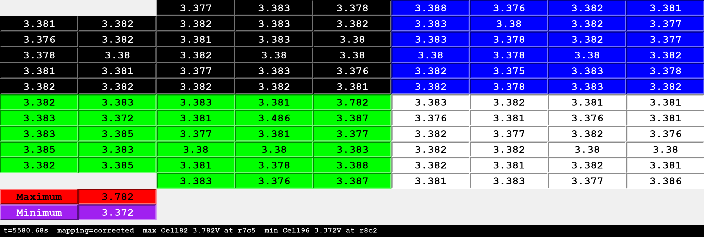

# cell_viewer — Coda pack cell voltage display

Renders all 104 cell voltages onto a picture of the pack, from a CAN log or a
live bus. A rebuild of the original `Cell_Voltage_Display.exe` tool, keeping its
exact visual baseline but fixing the cell placement.



A real capture: the pack near the end of a charge to 100%. Cell82 has run up to
3.782 V while the rest of the pack sits around 3.38 V and the lowest cell is at
3.372 V -- a 410 mV spread. Each block of colour is one module; the four blank
squares at top-left and bottom-left are where columns 1 and 2 hold five cells
instead of six. Rendered with `--mapping corrected --scale 2`.

## Where the data comes from

The BMS broadcasts cell voltages continuously on **C CAN** — 26 frames,
IDs `0x000`–`0x019`, four 16-bit big-endian millivolt values per frame,
104 cells total. Nothing is requested; the frames are simply there.

> This is a **different path** from `read_cell_voltages_and_temps.py` in the
> repo root, which asks for cells over UDS through the gateway on
> `0x722`/`0x72A`. That one works from the OBD connector on any Coda. This one
> needs a physical tap on C CAN (CAN-H pin 7, CAN-L pin 15 of the BMS
> connector), which most people will not have. They are not interchangeable.

Broadcast rate depends on vehicle state: about **0.15 s** while driving, but as
slow as **14 s** between bursts on a plugged-in car. A live display looking
frozen for 14 seconds is the BMS, not this tool.

## Why the rebuild exists

The original tool decodes CAN correctly but places **44 of 104 cells in
the wrong physical position**. It lays every module out in the same direction,
whereas the pack boustrophedons — it snakes back and forth. The corrected rule
is that **even-numbered display columns are mirrored top-to-bottom within their
own module**. No cell ever changes module or column; only its row within its
module moves.

Both mappings ship. `corrected` is the default and is what the tool is for;
`app` reproduces the original's placement, which is useful only for comparing
against old screenshots.

## Usage

```bash
pip install -r ../requirements.txt

# What is in a capture, and which instants are worth looking at
python cell_viewer/cell_viewer.py --log capture.log --scan

# Render one instant to a PNG
python cell_viewer/cell_viewer.py --log capture.log --at demo --render grid.png

# Replay a capture in the Tkinter window
python cell_viewer/cell_viewer.py --log capture.log --gui --speed 20

# Live from a bus (dongle auto-detected, same detection as read_dtcs_coda.py)
python cell_viewer/cell_viewer.py --live --gui
```

Logs are read through `can.LogReader`, so candump `.log`, Vector `.asc` and
`.blf` all work.

### Options

| Option | Effect |
|---|---|
| `--log PATH...` | One or more capture files. Globs are expanded; multiple files are merged in timestamp order. |
| `--live` | Capture from a bus instead of a log. Drives `--gui` only. |
| `--interface`, `--channel`, `--bitrate` | Hardware for `--live`. Interface and channel auto-detect when unset. |
| `--channel` (with `--log`) | Which recorded channel carries C CAN. By default it is found **by content** — the channel carrying IDs `0x000`–`0x019` — never by channel name, which moves with dongle insertion order. |
| `--mapping corrected\|app\|both` | Cell placement. `both` writes `<out>_app.png` and `<out>_corrected.png`. Default `corrected`. |
| `--at T` | Instant to render: seconds, or `demo` / `max-spread` / `max-cell` / `min-cell`. `demo` picks the widest-spread sweep whose extreme cell actually moves between the two mappings. |
| `--partial` | Keep sweeps missing some of the 104 cells, for a capture that starts or ends mid-pack. Un-seen cells render as their `NN_k` placeholder and the Maximum/Minimum readouts describe only the cells present. Without it such a capture yields nothing. |
| `--render OUT.png` | Write a PNG (needs Pillow). |
| `--render-scope OUT.png` | Write the second window (min/max history). |
| `--gui` | Live Tkinter display. |
| `--cache FILE` | Write or reuse per-sweep snapshots so later renders are instant. `--refresh` forces a rescan. |
| `--scale N` | PNG scale factor. `2` matches the DPI of the original tool's screenshots. |
| `--scope-mode fixed\|original` | See below. |

## Deliberate deviations from the original

Everything else is reproduced as-is, including the per-sweep max/min semantics
(the readouts reset on frame `0x000` and publish on `0x019`, so they describe
one sweep rather than an all-time extreme), the `str(mv/1000)` label text, the
`NN_k` placeholder for cells not yet seen, and the second window's typo'd title.

1. **The second window's scaling is fixed, not reproduced** (`--scope-mode
   fixed`, the default). The original scales that plot with a height belonging
   to the *first* window, on a canvas half as tall; solving for a visible point
   gives V > 3.4, so for a resting LFP pack it is permanently blank. The
   default here autoranges to the data. `--scope-mode original` reproduces the
   broken scaling exactly.
2. **`app` is available but not the default** — see above.
3. **No Kvaser `canlib32.dll`.** Live capture goes through python-can; log
   replay needs no hardware at all.

## Files

| File | Contents |
|---|---|
| `cell_viewer.py` | The viewer: log and live sources, `PackState`, `--scan`, the Pillow PNG renderer and the Tkinter display. |
| `layout.py` | Graphics constants from the original, the pack module table, `build(mapping)` for either grid, and `decode_frame()` for the C CAN cell frames. |

## Tests

`../test_cell_viewer.py` covers decoding, both mappings, log replay, partial
captures and PNG rendering. It synthesises its own capture, so it needs no
vehicle, no CAN hardware and no display:

```bash
python -m pytest test_cell_viewer.py -v
```

The Tkinter display is not covered — it needs a desktop session.

### Testing --live without a vehicle

`--live` opens a real CAN channel, so no automated test reaches it.
[`../playback/coda_fake_cells.py`](../playback/coda_fake_cells.py) broadcasts
synthetic cell sweeps for that purpose — run it on one dongle and the viewer on
another wired back to back, or both over a Linux vcan pair. See
[`../playback/README.md`](../playback/README.md).

```bash
python playback/coda_fake_cells.py --interface pcan --channel PCAN_USBBUS1 --low-cell 56
python cell_viewer/cell_viewer.py --live --interface kvaser --channel 0 --gui
```

Verified this way on a Kvaser Leaf Light v2 / PCAN-USB FD bench link: cell
sweeps transmitted on one dongle and read back through `--live` on the other
decoded identically, with the injected low cell recovered exactly.
